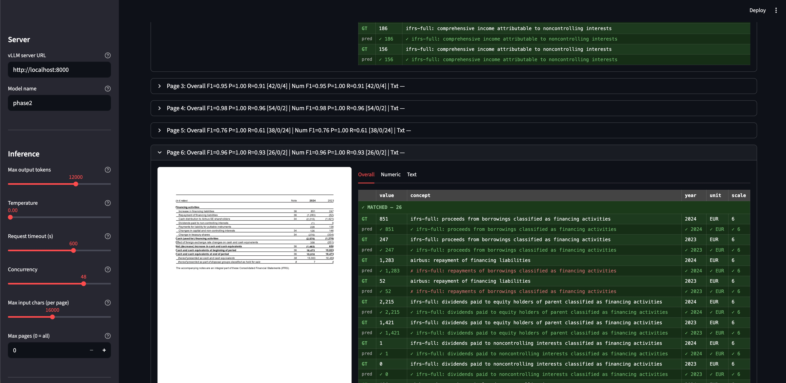
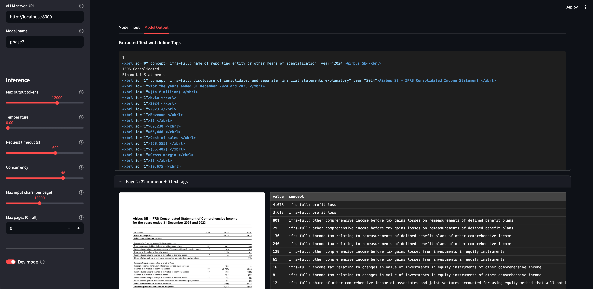

# iXBRL Tagging Demo

Demo for the `xbrl-model`, a fine-tuned model that tags both numeric facts and text disclosures in ESEF XHTML filings using inline `<xbrl>` annotations.

## Screenshots






## Prerequisites

- Python 3.10+
- NVIDIA GPU (2×A40 recommended) with vLLM installed
- Chromium for Playwright (install once, see below)

## Setup

```bash
cd ixbrl-tagging-client
pip install -r requirements.txt
playwright install chromium
```

### Download model weights

```bash
bash download.sh
```

Prompts for HuggingFace token. Downloads `amaljoe88/xbrl-model` into `models/phase2`.

## Running

**Terminal 1: start vLLM server**

```bash
bash scripts/serve.sh
```

**Terminal 2: start the demo**

```bash
streamlit run src/main.py
```

Open `http://localhost:8501` in your browser after port forwarding.

## Usage

### XHTML filing with iXBRL tags (full evaluation)

1. Upload an ESEF XHTML filing (`.xhtml`)
2. Filing year and page class are auto-detected, edit if needed
3. Click **Tag Document** — only pages containing iXBRL entities are rendered and tagged
4. Click **Evaluate** to compare predictions against embedded ground truth
5. View holistic metrics (F1, Precision, Recall, Concept / Year / Unit / Scale accuracy) and per-page breakdowns for numeric, text, and overall entities

### XHTML filing without iXBRL tags

1. Upload a plain XHTML/HTML file
2. Enter the page numbers to tag (comma-separated or ranges, e.g. `1,3,5-10`)
3. Click **Tag Selected Pages** — tags extracted, no evaluation available

## Sidebar settings

| Setting | Default | Description |
|---|---|---|
| vLLM server URL | `http://localhost:8000` | Address of the OpenAI-compatible vLLM server |
| Model name | `phase2` | Served model name registered with vLLM |
| Max output tokens | 12000 | Maximum tokens generated per page |
| Temperature | 0.0 | Sampling temperature (0 = greedy) |
| Request timeout (s) | 600 | Per-page HTTP timeout |
| Concurrency | 48 | Pages sent to the model in parallel |
| Max input chars | 24000 | Truncation limit for extracted page text |
| Max pages | 0 (all) | Stop after this many tagged pages |
| Dev mode | off | Show raw model input and output per page |
